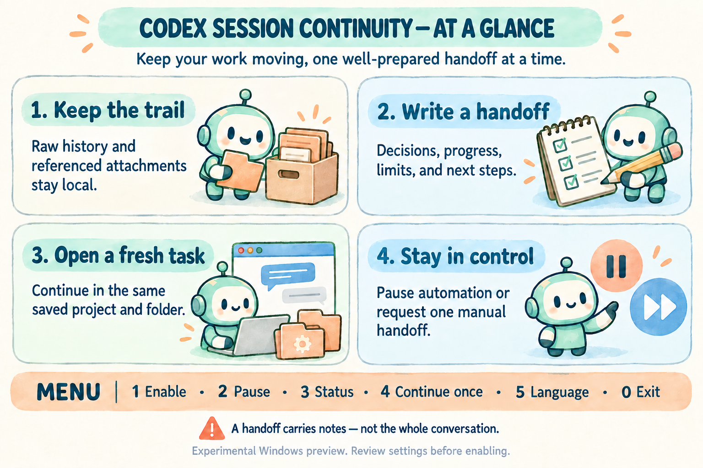
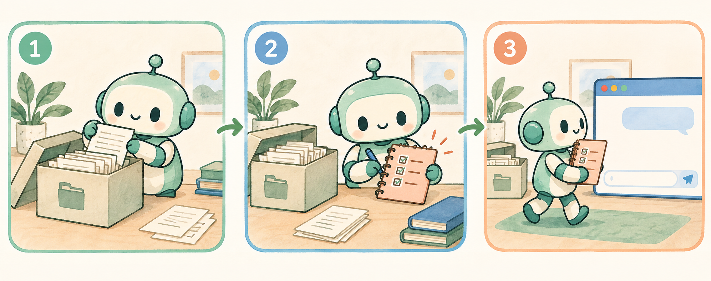

<div align="center">

# codex session continuity

**讓長時間的 Codex 工作，有條理地交接下去。**

[English](../README.md) · [繁體中文](README.zh-Hant.md) · [简体中文](README.zh-Hans.md) · [日本語](README.ja.md) · [Español](README.es.md) · [Français](README.fr.md) · [한국어](README.ko.md) · [Русский](README.ru.md) · [Deutsch](README.de.md)


</div>

本機原文保存、交接筆記與同專案續接的 Windows 小幫手。新任務先讀交接，再按需要查證歷史；不把全部對話重新塞入提示詞。

> [!IMPORTANT]
> 實驗性預覽版，並非 OpenAI 官方產品。依賴桌面 App 的本機介面，更新後可能需要相容性修正。新安裝預設暫停自動續接；先核對模型的有效上下文與門檻。

## 能做什麼



| 功能 | 說明 |
| --- | --- |
| 保留過程 | 增量保存已落盤的原始對話與工具紀錄，建立可檢索索引。 |
| 整理交接 | 請原助手寫下決策、進度、限制、驗證與下一步。 |
| 保留原專案 | 核對專案、工作目錄與權限，沿用 checkout 和未提交檔案。 |
| 照顧附件 | 保存支援的本機／內嵌附件及來源；保存不等於已理解內容。 |

## 三步交接



1. 保存原文：背景程序建立本機歷史與附件索引。
2. 準備交接：來源助手完成 HANDOFF.md 並回覆專屬確認碼。
3. 接續工作：來源輪次結束、位置與權限核對通過後，建立一個全新任務。

## Windows 安裝

需要已登入的 Codex Desktop、Node.js 24+、PowerShell 7+。先在 App 儲存工作的正確專案目錄，再建立一個獨立管理任務並複製其 UUID／連結；不要把它與待續接工作混為同一任務。

從 Releases 下載 ZIP 與 SHA256SUMS，核對 SHA-256 後解壓。以 PowerShell 7 開啟解壓目錄，將下方佔位文字改成真實管理任務 UUID。

[Releases](https://github.com/maiijhcg/codex-session-continuity/releases)

```powershell
pwsh -NoProfile -File .\install.ps1 -OwnerThreadId "PASTE_MANAGEMENT_TASK_UUID" -WithIntegration
```

預設安裝到 `%LOCALAPPDATA%\CodexSessionContinuity`，並加入目前使用者的 Windows 登入啟動項。重開機並登入後背景自動啟動，不需要管理員權限；這不是登入前的系統服務。新安裝的自動續接開關仍為暫停，後續登入保留你的選擇。

`-NoStartup` 不加入登入啟動；`-NoStart` 暫不啟動程序；`-InstallDir` 指定安裝目錄；`-CodexHome` 指定既有 Codex 資料目錄；`-SoftLimit`／`-HardLimit` 調整門檻。省略 `-WithIntegration` 可延後安裝 hook 與助手指引。Hook 必須透過 Codex 正常信任流程審查，不會自動授權。

## 手動操作


| 按鍵 | 作用 |
| --- | --- |
| **1** | 開啟自動續接 |
| **2** | 暫停自動續接；原文保存繼續 |
| **3** | 重新查看程序、桌面連線與請求狀態 |
| **4** | 明確選擇一個任務手動接續；支援完整 ID／連結 |
| **5** | 選擇並保存選單語言 |
| **0** | 離開選單，不更改開關 |

請先選 3，確認程序存活、心跳新鮮及桌面連線均正常，再按需選 1 或 4。任務以執行中優先、最近活動倒序排列。排入請求不等於已建立接續任務；重複點選會沿用待處理請求。

介面預設英文，提供英文、繁中、簡中、日文、西語。文件另有法語、韓語、俄語、德語。任務標題、歷史正文與低階技術診斷保持來源語言。選單 5 會記住語言；`-Language` 只覆寫本次啟動。

```powershell
.\Codex-Session-Continuity.cmd -Language zh-Hant
pwsh -NoProfile -File .\manual-switch.ps1 -Action Status -Language zh-Hant -Json
```

## 門檻與限制

範例預設為軟門檻 500,000／硬門檻 920,000，並非所有模型都適用。軟門檻只接受連續監視中由下往上的跨越；啟動／恢復時已高於軟門檻不補發，等待目前用量達硬門檻。原生壓縮可能使用另一計數或更小的有效窗口，本程式不改模型與壓縮設定，也不擴大模型上下文。

## 資料與安全

安裝目錄內的 `archive/`、`notes/`、執行期 `assets/`、SQLite、設定及日誌都屬私密資料，不要上傳 GitHub。程式不新增遙測或獨立雲端上傳客戶端；正常 Codex 訊息／建立任務仍使用既有帳號與服務。

原文與媒體不會自動刪除，請留意磁碟空間並自行備份；此工具不提供加密、OCR 或語音轉文字。遠端附件不會偷偷下載。暫停不會撤回已送出的操作，完全停止程序才會停止後續歸檔。

[SECURITY.md](../SECURITY.md)

## 遇到等待或錯誤

`waiting_handoff` 表示等來源交接；`soft_expired` 表示過期軟觸發不補發；`checkpoint_interrupted` 應由你決定是否重新手動選取。`checkpoint_uncertain`／`creation_uncertain` 必須先查明結果，禁止盲目重送。專案或權限不符時停止核對，不轉去預設目錄、不自動提權。

```powershell
node .\cli.mjs status
node .\cli.mjs tasks
node .\controller.mjs resolve "PASTE_TASK_UUID"
```

## 啟動、升級與移除

以下命令在已安裝目錄執行。升級前先停止程序並備份整個私密執行目錄，再用相同安裝目錄執行新版安裝器。移除流程會保留程式、設定、原文、筆記與附件；不刪除 Codex 任務。

```powershell
pwsh -NoProfile -File .\install-startup.ps1
pwsh -NoProfile -File .\install-startup.ps1 -Remove
pwsh -NoProfile -File .\stop.ps1
pwsh -NoProfile -File .\restart.ps1
pwsh -NoProfile -File .\uninstall.ps1
```

[完整英文 Windows 指南](WINDOWS.md) · [CHANGELOG](../CHANGELOG.md) · [NOTICE](../NOTICE.md)

尚未指定公開授權，未擅自套用 MIT／GPL；詳見 NOTICE.md。插圖為 ImageGen 原創概念圖，不是實際介面截圖或功能保證。

## 自動續接指示與權限繼承

傳給原 session 的交接通知及新 session 的開場指示均支援九語言：`en`、`zh-Hant`、`zh-Hans`、`ja`、`es`、`fr`、`ko`、`ru`、`de`。預設英文，跟隨選單 5 保存的語言。新安裝加 `-HandoffLanguage zh-Hant` 可獨立指定；既有安裝先停止程序，在 `config.json` 加入 `"handoffLanguage": "zh-Hant"` 屬性，再重新啟動。升級保留設定；刪除此屬性便恢復跟隨選單。單次 `-Language` 不改背景指示。同一次交接固定使用選定語言；任務原標題、路徑、指令、權限值及確認碼不翻譯，底層診斷保留原文。

新 session 自動沿用上一個 session 的實際 sandbox 與審批權限，不要求它等於全域預設，也不使用管理任務的權限。例如來源唯讀、全域 Full access，後繼仍須唯讀。程式透過 Codex 的來源繼承流程建立，送出前重查來源，建立後核對可寫範圍、網路限制及權限 profile。來源變更會重新讀取；未知或不符時保留既有新 ID 並停止查證，不提權、不改全域、不重複建立。唯讀來源若無法保存 HANDOFF.md，須由使用者依正常權限流程處理，程式不繞過限制。本機舊版不會因公開版變更而自動更新。

